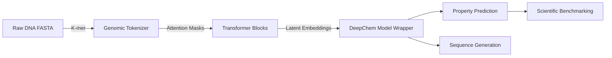

# GSoC 2026 Proposal: Scaling Biological Foundation Models in DeepChem

**Target Organization**: DeepChem (Computational Biology)  
**Project Size**: 350 Hours (Large)  
**Contributor**: Saurabh Kumar Bajpai  
**Status**: ENHANCED (Mentor-Ready)

---

## 1. Project Overview
This project proposes the integration of state-of-the-art **DNA and Single-Cell Foundation Models** into DeepChem using a unified **HuggingFaceModel** wrapper. This will provide researchers with plug-and-play access to multi-billion parameter biological LLMs.

### 1.1 Genomic LLM Pipeline (Mermaid)

---

## 2. Technical Deep-Dive

### 2.1 The Genomic Tokenizer Engine
DNA sequences require specialized tokenization unlike natural language. I will implement:
- **K-mer Tokenization**: Support for overlapping and non-overlapping k-mer strategies.
- **DeepChem Integration**: Extending `dc.feat.MolnetTokenizer` for genomic-scale datasets.
- **Interoperability**: Seamlessly converting `AnnData` (single-cell) formats into DeepChem-compatible tensors.

### 2.2 Foundation Model Scaling
To handle 7B+ parameter models (like OLMo-DNA) on research hardware:
- **Mixed Precision**: Implementing BF16/FP16 training loops in the `dc.models` layer.
- **Gradient Checkpointing**: Ensuring large biological sequences can fit within standard GPU memory constraints (V100/A100).
- **LoRA/QLoRA**: Providing adapters for parameter-efficient fine-tuning of foundation models on niche biological tasks.

---

## 3. Implementation Plan (12 Weeks)

### Phase 1: Genomic Foundation (Weeks 1-3)
- [ ] Implement `DNAFoundationModel` extensions for HuggingFace integration.
- [ ] Develop high-performance K-mer tokenizers with custom windowing.
- [ ] Baseline testing on the DeepChem `GENIE` benchmark.

### Phase 2: Single-Cell Integration (Weeks 4-7)
- [ ] Build the `scBERT` and `Geneformer` model wrappers.
- [ ] Create an automated pipeline for AnnData-to-DeepChem conversion.
- [ ] Fine-tune sc-models on cell-type annotation tasks.

### Phase 3: Scaling & Optimization (Weeks 8-10)
- [ ] Integrate mixed-precision training and gradient checkpointing.
- [ ] Benchmark scaling performance across 1B, 3B, and 7B parameter models.
- [ ] Implement LoRA support for genomic LLMs.

### Phase 4: Finalization (Weeks 11-12)
- [ ] Finalize the "Bio-Foundation" tutorials in the `examples` folder.
- [ ] Technical documentation for the new `dc.models.genomics` package.
- [ ] Community handover and final review.

---

## 4. Why me?
- **AI-Bio Specialist**: Background in Biotechnology and AI Engineering (Akoode Technologies).
- **BioAgent-ALPHAFOLD**: Researched agentic workflows for protein structure and DNA prediction.
- **Winner of Global Agent.AI Challenge**: Proven history of shipping high-impact AI systems.

## 5. Deliverables
- [ ] `DNAFoundationModel` & `SingleCellModel` wrappers.
- [ ] High-performance Genomic Tokenizers.
- [ ] LoRA fine-tuning infrastructure for Bio-LLMs.
- [ ] Comprehensive benchmarking report.
