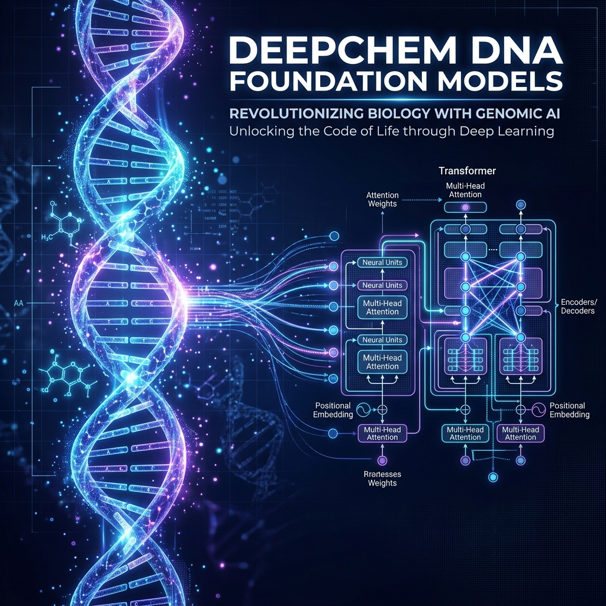
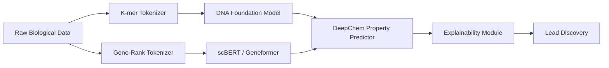

# DeepChem DNA & Single-Cell Foundation Models

## 🧬 Overview
DeepChem has been at the forefront of AI-powered drug discovery. As biological data scales, there is an urgent need to transition from task-specific models to **Foundation Models** that capture the latent representation of life's code. This project focuses on integrating high-performance **DNA and Single-Cell LLMs** into the DeepChem library, providing a unified `HuggingFaceModel` wrapper for researchers.

## 🏗 System Architecture

## 🌟 Key Features
- **Genomic-Native Tokenization**: Advanced DNA k-mer tokenizers with custom windowing for optimal sequence representation.
- **Single-Cell Interoperability**: Seamless loading and fine-tuning of cell-count matrices using the scBERT architecture.
- **Unified HF Wrapper**: A standardized interface to import and scale any HuggingFace biological transformer within DeepChem workflows.
- **Mixed-Precision Scaling**: Optimized training loops using BF16/FP16 to handle large foundation model fine-tuning on consumer and HPC hardware.

## 📄 Proposal
The 350-hour engineering proposal is available here: [PROPOSAL.md](PROPOSAL.md)

## 📅 Roadmap
- **Phase 1**: Genomic Foundation & DNA Tokenizers (Weeks 1-3)
- **Phase 2**: Single-Cell Pipeline & scBERT (Weeks 4-7)
- **Phase 3**: Benchmarking on Scientific Datasets (Weeks 8-10)
- **Phase 4**: Optimization & Documentation (Weeks 11-12)

Detailed timeline: [TIMELINE.md](TIMELINE.md)

## 👨‍💻 Contributor
**Saurabh Kumar Bajpai**  
AI Engineer | GSoC 2026 Applicant  
[GitHub Profile](https://github.com/saurabhhhcodes) | [LinkedIn](https://linkedin.com/in/saurabhbajpai03)
